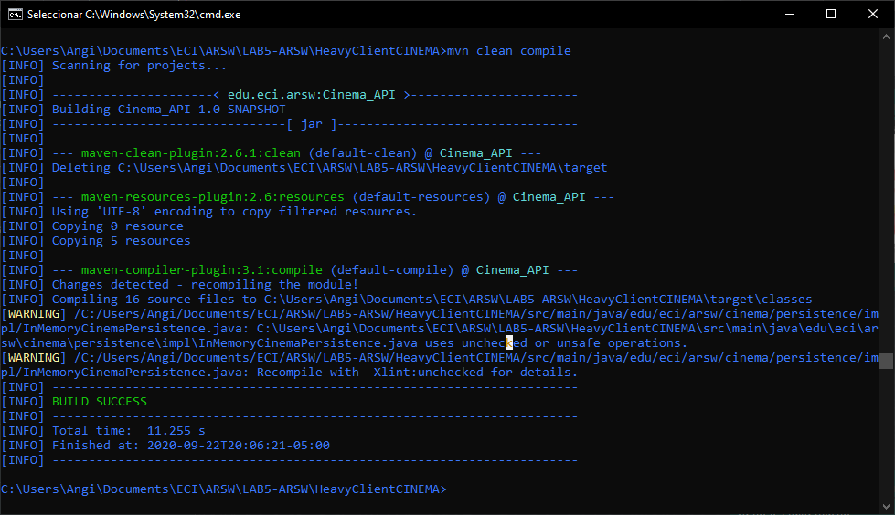
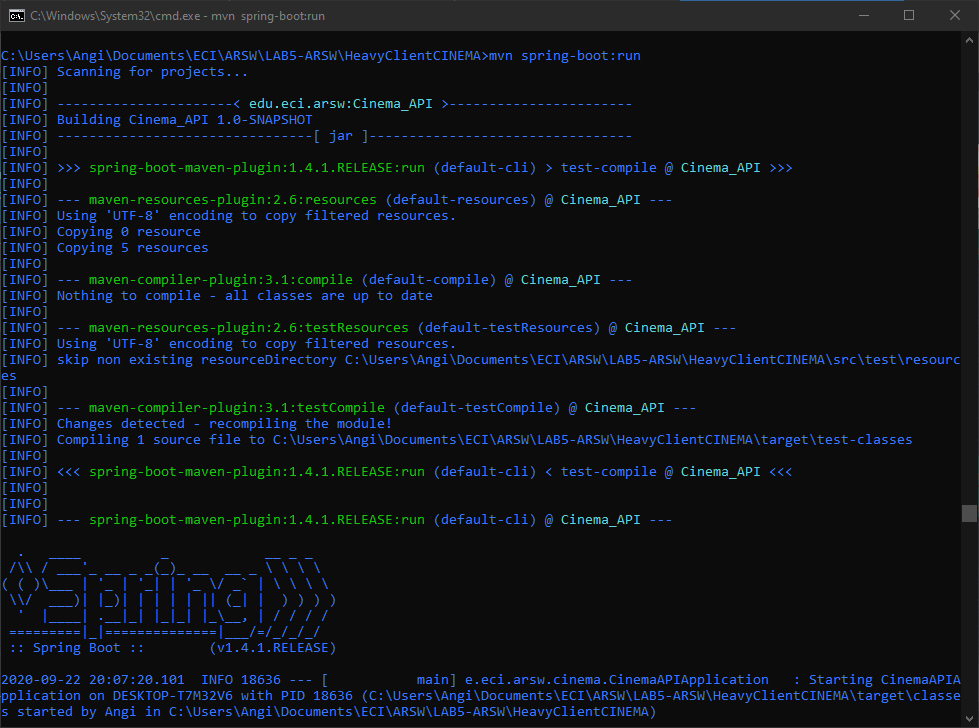
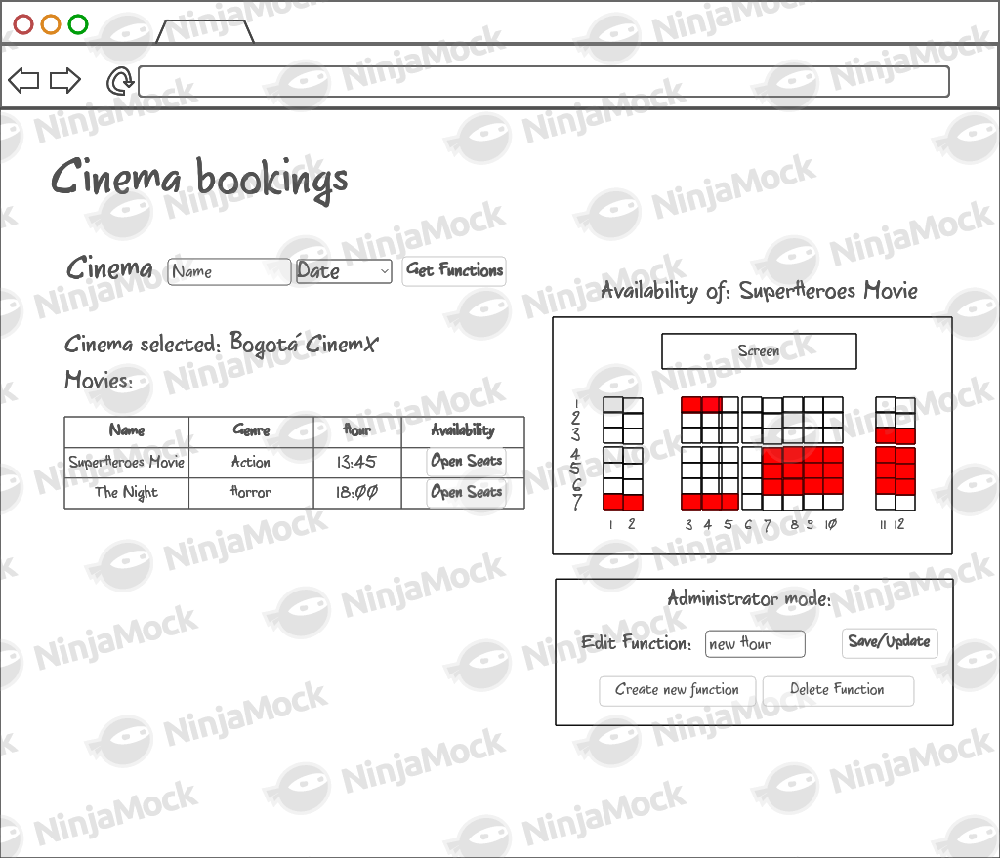

# 🛠️ LABORATORIO 6
  
  📌 **Angi Paola Jiménez Pira**
  
## Compile and Run Instructions

   Es necesario tener instalado [maven](https://maven.apache.org/ "maven") en el equipo que se desee correr el programa. Abra la consola y ubiquese donde desea tener 
   este proyecto, inserte el comando `git clone https://github.com/angipaola10/LAB6-ARSW` para clonar el proyecto en su computador, se creará la carpera **/LAB6-
   ARSW**

   * **Compilar**
     
       Estando en la consola, ingrese a la carpeta **/LAB6-ARSW/HeavyClientCINEMA**  y ejecute el comando `mvn clean compile` para compilar el programa
       
	 

   * **Ejecutar**
      
       Luego de compilar el programa, en la misma ubicación inserte el comando de ejecución `mvn spring-boot:run`
	 
	  

## Heavy client - Cinema Book System II

### Dependencias

* [Laboratorio Construción de un cliente 'grueso' con un API REST, HTML5, Javascript y CSS3. Parte I. - Caso Cinema](https://github.com/angipaola10/LAB5-ARSW) 

### Descripción 

Se desea generar una pequeña interfaz de administrador para el sistema de gestión de compra/reserva de boletos de cine. Para efectos prácticos del ejercicio se creará un espacio en la misma pantalla destinado para esto, tal y como se ve en el mock provisto.

1. Agregue el campo de entrada para editar el horario de la función y el botón 'Save/Update'. Respetando la arquitectura de módulos actual del cliente, haga que al oprimirse el botón:

    1. Se haga PUT al API, con la función actualizada, en su recurso REST correspondiente.
    
    2. Se haga GET al recurso /cinemas/{name}/{date}, para actualizar el listado de las funciones del cine y de la fecha previamente seleccionados.
    
    Para lo anterior tenga en cuenta:
  
      * jQuery no tiene funciones para peticiones PUT o DELETE, por lo que es necesario 'configurarlas' manualmente a través de su API para AJAX. Por ejemplo, para 
      hacer una peticion PUT a un recurso /myrecurso:
      	
			return $.ajax({
			    url: "/mirecurso",
			    type: 'PUT',
			    data: '{"prop1":1000,"prop2":"papas"}',
			    contentType: "application/json"
			});
			
	     Para éste note que la propiedad 'data' del objeto enviado a $.ajax debe ser un objeto jSON (en formato de texto). Si el dato que quiere enviar es un 
	     objeto JavaScript, puede convertirlo a jSON con:
	
			JSON.stringify(objetojavascript),
			
      *  Como en este caso se tienen dos operaciones basadas en callbacks, y que las mismas requieren realizarse en un orden específico, tenga en cuenta cómo usar las 
      promesas de JavaScript [mediante alguno de los ejemplos disponibles](https://codepen.io/hcadavid/pen/jrwdgK).

2. Agregue el botón 'Create new function', de manera que cuando se oprima:

      * Se borre el canvas actual.
      
      * Se solicite el nombre y género de la película, además de la hora de la nueva función (usted decide la manera de hacerlo). Se tendrá en cuenta el nombre del 
      cine y la fecha actualmente consultados para asociarles la función.
      
      Esta opción debe cambiar la manera como funciona la opción 'save/update', pues en este caso, al oprimirse la primera vez (es decir cuando se va guardar la nueva 
      función 'save') debe (igualmente, usando promesas):
     
      1. Hacer POST al recurso /cinemas/{name}, para crear la nueva función.
	  
	  2. Hacer GET al respectivo recurso, para actualizar el listado de funciones.

3. Agregue el botón 'DELETE', de manera que (también con promesas):

      * Borre el canvas.

      * Haga DELETE de la función actualmente seleccionada.

      * Haga GET de las funciones ahora disponibles.
